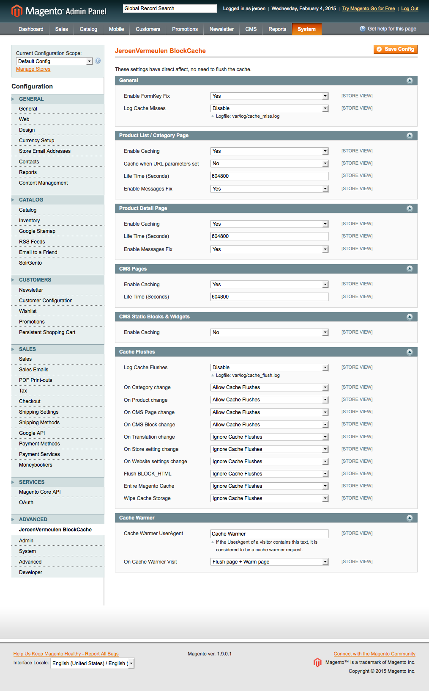

## JeroenVermeulen_BlockCache
Performance improvement by caching big blocks in Magento.

**We are sorry but we cannot offer customer support for this extension, and it is provided "as-is" for free. We use it at a number of shops and it works well.**

This extension is meant to speed up shops which are not running on Varnish.

### Installation

[Please follow this manual.](https://github.com/jeroenvermeulen/jeroenvermeulen-blockcache/wiki/Installation-Manual)

### Config Settings:

`System > Configuration > ADVANCED > JeroenVermeulen BlockCache`

### Cache Big Blocks
This Magento Extension adds functionality to cache these blocks which are normally not cached in Magento:

* Category List Page: Whole content area
* Product Detail Page: Whole content area
* CMS Page: Whole content area
* Cms Static Blocks & Widgets (disabled by default)

### Log & Filter Cache Flushes
This Extension also adds functionality to log & filter cache flushes:

* On Category change
* On Product change
* On CMS Page change
* On CMS Block change
* On Translation change
* On Store setting change
* On Website settings change
* Flush BLOCK_HTML
* Entire Magento Cache
* Wipe Cache Storage

It does this by extending [Cm_Cache_Backend_File](https://github.com/colinmollenhour/Cm_Cache_Backend_File) or [Cm_Cache_Backend_Redis](https://github.com/colinmollenhour/Cm_Cache_Backend_Redis)

### Config Screenshot

